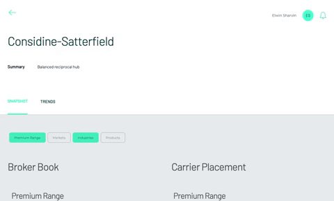

<br />
<p align="center">
  <a href="https://github.com/Kristiannmiller/HW-Take-Home">
    
  </a>
  <h1 align="center" style="padding:0px; margin:10px 0px">Front End Code Challenge</h1>
  <h5 align="center" style="margin:0px 0px 20px 0px; padding:0px;">Executed by Kristi Miller</h5>
  <p align="left">
    This is a code challenge for an open Associate Front End position. The company wants to create a new feature that gives an insurance carrier the ability compare broker data to the user's current insurance data side-by-side.
    <br/>
    <br/>
    The company provided a <a href="https://invis.io/RWXOGR6E7AT#/421418913_Evaluate_Stats_Filter_Open_Copy_2">design prototype </a> and a <a href="https://docs.google.com/document/d/1HB2hcpzUeHeaxDxUnJFIjzq0dlXYKixPNK6wtz6RaF8/edit">project spec </a>

  </p>
</p>

## About The Project

### Built With
* JavaScript
* React
* CSS
* Chart.js
* Jest & React Testing Library
* Apollo Client

### Installation
To install the application:
1. Clone the repo
2. Install NPM packages
3. run `npm start`
4. Open `localhost:3000` in your browser

### Testing
To see test suites:
```
npm test
```

### Features
- The broker's data should be displayed in the header
- The user should be able to toggle between visible views (Premium Range, Markets, Industries, and Products) and display multiple menu options at the same time
- A user should be able to click on a list item from each chart's legend, see the selection in bold, and see the appropriate data (percentage and premium dollars) for that selection displayed with the chart.

## About The Process

### My Process
1. READING / RESEARCH : I began by thoroughly reading through the provided project spec. While doing so I pulled up the data and examined the structure. I composed an email with all the questions I had (there were quite a few, since some of the data didn't quite align with the design prototype)

2. PLANNING / SETUP : I created a basic React-app next, and set up a repository to work from along with a project board with detailed issues. I split the project into five total sprints - Setup, Layout, Functionality, Testing, and Final Touches.

3. LAYOUT : Following the design prototype, I created all of the basic components needed and added styles using CSS.

4. FUNCTIONALITY : Following the project spec and the answers to my previous questions, I brought function to each of the components. This is also where I successfully communicated with the server.

5. TESTING : My original goal was to complete at least two unit tests per component, but given the time constraint I ended up with a few unit tests.

6. FINISHING TOUCHES : I took a little time at the end to fix a few minor styling issues, address some linting issues, and update the project ReadMe.

### Wins

- Planning - I am a very organized person who likes to research and plan before any project. I successfully took the time to research the technologies I had not used before (Apollo, graphQL), and the time spent researching paid off. I also took the time to utilize a project board, which helped me stay on task and meet deadline goals.

- New Techs - There were quite a few new technologies in this project for me. While I'm very familiar with React and React Hooks, I have never used Apollo or GraphQL before. GraphQL is incredibly powerful, and it's a great way to target only the data you need. I was really impressed with the simplicity it brought to the project when it came time to bring in the data.

- Innovative Solutions - Given the time constraint of five hours, I found myself coming up with quick ways to solve some of the time consuming issues that relying on event bubbling can bring up. I realized that most areas that I would normally rely on event bubbling to determine the source of an event could be quickly handled with a specific string. This might not be the most ideal solution, but it was one that saved me a lot of time and digging throughout this project.

### Challenges

- Chart.js - While I'm familiar with Chart.js and have used it in a few previous projects, I have never used it with TypeScript. I had initially decided to use TypeScript because I've found the errors TypeScript provides to be helpful in past projects. However, when it came time to bring in Chart.js, adding types to those components was a lot more difficult and time-consuming than I had anticipated. I decided to move to JavaScript to save time, but I did spent a little more time than I should have trying to get TypeScript to work.

- Testing with GraphQL/Apollo - Since these are new technologies for me, I didn't quite have enough time to research how to mock out the api calls and properly test the components. Ideally, I would have liked to include more unit and integration tests.

#### Contact Kristi
* [Github](https://github.com/Kristiannmiller)
* [Portfolio](http://www.kristiannmiller.com)
* [LinkedIn](https://www.linkedin.com/in/kristiannmiller/)

#### Additional Links
- [Challenge Outline](https://docs.google.com/document/d/1HB2hcpzUeHeaxDxUnJFIjzq0dlXYKixPNK6wtz6RaF8/edit)
- [Schema](https://hw-fe-challenge-api.herokuapp.com/graphiql)
- [Repository](https://github.com/Kristiannmiller/HW-Take-Home)
- [Project Board](https://github.com/Kristiannmiller/HW-Take-Home/projects/2?add_cards_query=is%3Aopen)
